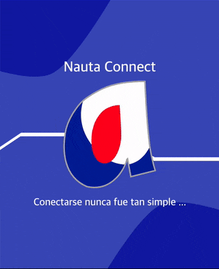

# Extensión Nauta Connect 

### Ejemplo de la UI/UX final

---

### Extensión para conectarse a la red Nauta de ETECSA de forma rápida, fácil y segura.

#### Toda colaboración al proyecto es bienvenida.

Extensión de código fuente abierto, publicado en Github en el enlace [mmaciass/nauta-connect](https://github.com/mmaciass/nauta-connect)

#### Ya puedes instalarlo en tu navegador.
- Para Google Chrome, desde el enalce de  [Google/nauta-connect](https://chrome.google.com/webstore/detail/nauta-connect/ppopcmgfgajciikdmipmmpffkpccinep).
- Para Mozilla Firefox, desde el enalce de  [Firefox/nauta-connect](https://addons.mozilla.org/es/firefox/addon/nauta-connect/).

#### Tecnologías y herramientas utilizadas en el proceso de desarrollo:

- React ^16.13.1
- Redux ^4.0.5
- Node ^v13.12.0
- Yarn ^1.22.4
- NPM ^6.14.5
- Otras

#### Navegador en que se ha probado satisfactoriamente

- Google Chrome
- Mozilla Firefox
- Opera

#### Pasos para configurar el proyecto

- Clonar el proyecto de Github.
- Abrir un terminal en la carpeta del proyecto y ejecutar el siguiente comando: `yarn` o `npm install`.
- Esperar hasta que termine de instalarse las dependencias.
- Para comenzar el modo de desarrollo ejecutar el comando `yarn start` o `npm run start`.
- Una vez terminado el transpilado, ya se puede instalar en el navegador la extensión en modo desarrollador.

Para compilar la extension en modo de producción debe ejecutar el comando `yarn build` o `npm run build`.

### Funciones que aún faltan por implementar:

- Por el momento se me acabaron las ideas... AHORA ES CUANDO CUALQUIER IDEA ES BIENVENIDA 🎉 📬
